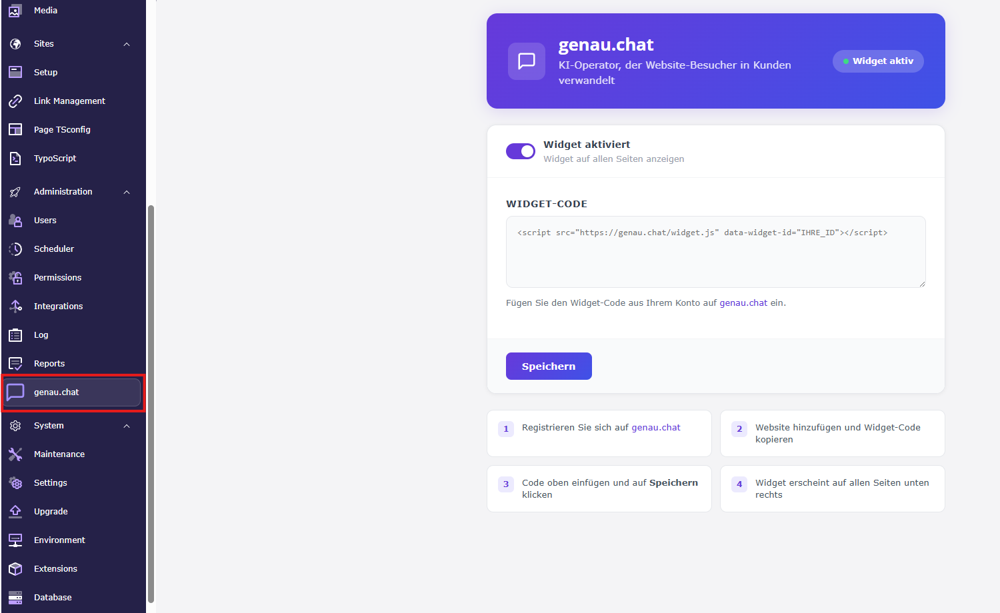

# genau.chat Widget for TYPO3

Adds the [genau.chat](https://genau.chat) AI chat widget to your TYPO3 website.
The widget turns website visitors into customers — easy setup in just 3 minutes.

## Why use this plugin?

- **Ready in 3 minutes** — install, paste your widget code, done
- **No database changes** — the plugin does not add or modify any database tables
- **Zero performance impact** — the widget script is injected before `</body>`, so it never blocks page rendering
- **No coding required** — everything is configured through the TYPO3 backend
- **One toggle to rule them all** — enable or disable the widget site-wide with a single click
- **Safe & validated** — only scripts from genau.chat are accepted, preventing accidental third-party code injection

## Requirements

- TYPO3 13.4+
- PHP 8.2+

## Installation

```bash
composer require genauchat/typo3-plugin
```

Then flush TYPO3 caches.

## Setup

1. Go to **Admin Tools → genau.chat** in the TYPO3 backend
2. Sign up at [genau.chat](https://genau.chat) and add your website
3. Copy your widget code and paste it into the field
4. Click **Save** — the widget appears on all pages immediately

After installation, a new **genau.chat** item appears in the left navigation of the TYPO3 backend:



## Features

- Backend module for easy configuration
- Enable / disable widget with one click
- Widget code is injected before `</body>` on all frontend pages
- Validates that the script belongs to genau.chat

## Uninstallation

1. Remove the widget code from the backend module (optional but recommended)
2. Run the following command:

```bash
composer remove genauchat/typo3-plugin
```

3. Flush TYPO3 caches
4. In the TYPO3 backend go to **Admin Tools → Extensions** and deactivate the extension if it still appears in the list

The plugin leaves no traces — no database tables are created, so no cleanup is needed.

## License

GPL-2.0-or-later
